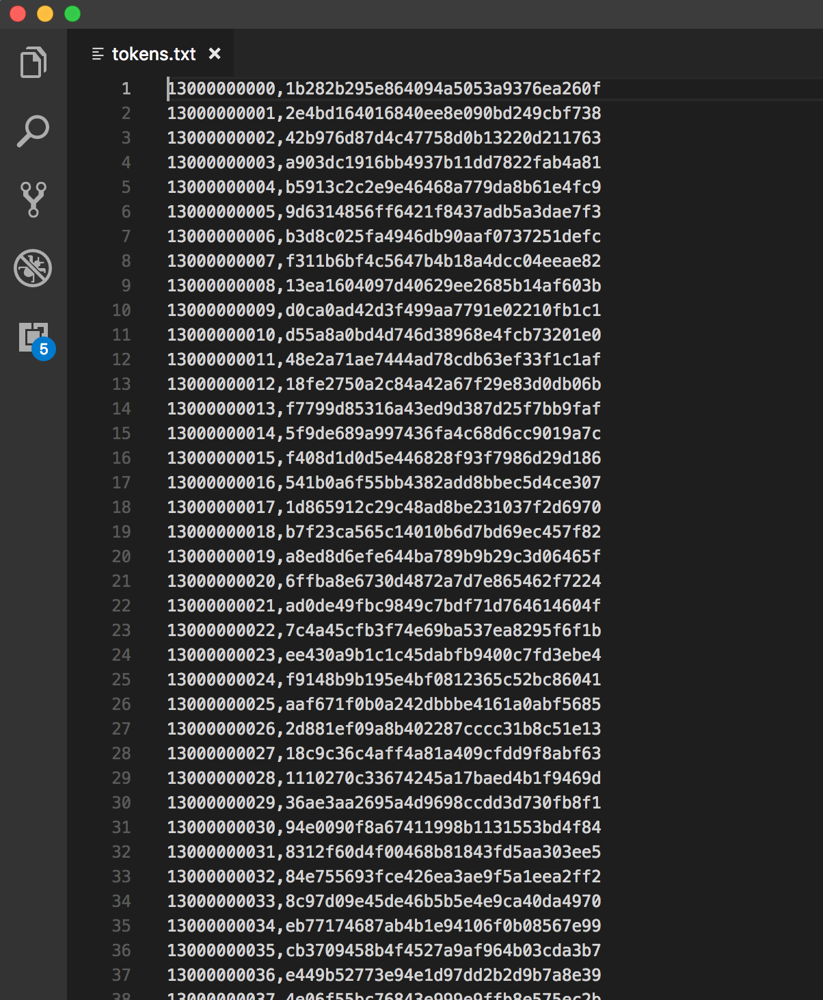
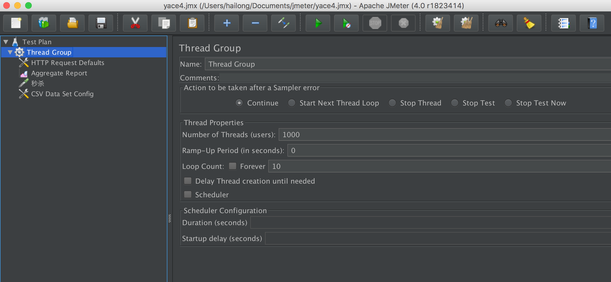
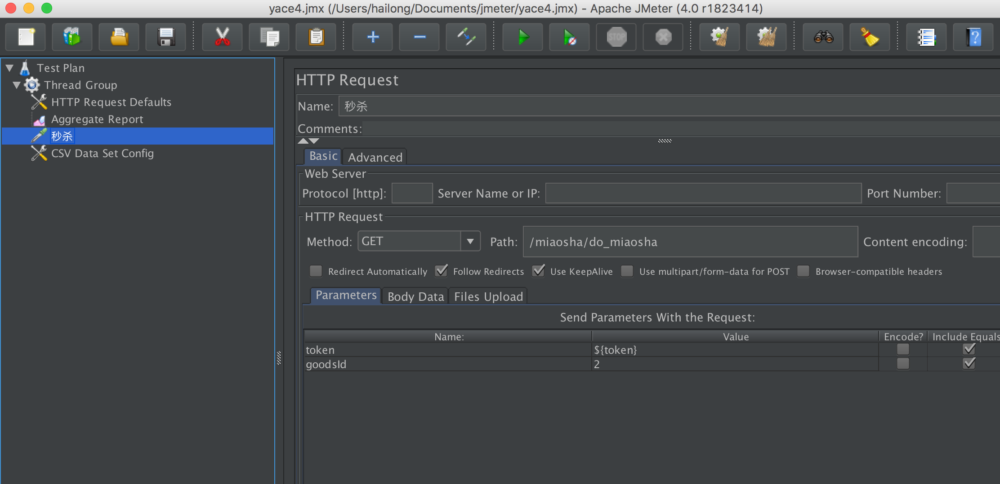
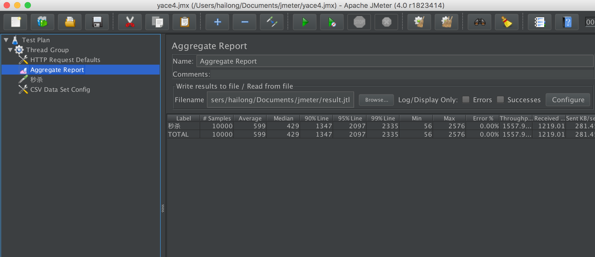

# 一、核心技术栈
1. spring boot + mybatis + druid + redis + thymeleaf + rabbitmq + nginx + jmeter + jquery + ajax
2. 两次 md5 入库
3. jsr303 参数校验
4. 全局异常处理：@ControllerAdvice + @ExceptionHandler
5. 分布式 session (redis 实现)
6. Jmeter 模拟多用户同时进行秒杀比较优化前后QPS
7. 页面级缓存+URL级缓存+对象级缓存
8. 页面静态化与前后端分离: 静态html + ajax + controller 返回 json


# 二、如何使用
1. 新建 miaosha 数据库与数据表并修改 application.properties 中的数据库密码
2. 配置好 redis 并启动 redis-server /usr/local/etc/redis.conf 和 mysql
3. 运行 MiaoshaApplication 浏览器输入 127.0.0.1:8080/login/to_login 进行登录


# 三、开发过程
## 1. 项目环境搭建
### 1.1 输出结果封装
- 输出结果使用Result.java类封装，为了是代码优雅使用类CodeMsg进一步封装各种异常

### 1.2 集成 Thymeleaf
- pom依赖 + 配置 + 测试页面

### 1.3 集成Mybatis与Druid
- pom依赖 + 配置 + 测试页面
- 数据库事务：已有id为1的记录，先插入id为2的记录和id为1的记录，因为id不可重复，测试代码是否全部回滚

### 1.4 集成redis缓存系统
1. 安装redis
    - redis启动时需要制定配置文件redis.conf，不指定会使用默认的配置文件
    - 修改redis配置文件：
    - bind 127.0.0.1 ::1 意思是允许哪些ip可以放完redis服务器，127.0.0.1指只有本地可以访问，这里改成 bind 0.0.0.0允许任意服务器均可访问这个redis
    - daemonize no 改成 daemonize yes 允许后台执行
    - redis-server /usr/local/etc/redis.conf      启动 redis 服务器
    - redis-cli 进行访问
    - 关闭redis 需要先进入 redis-cli 执行 shutdown save
    - ps -ef | grep redis 查看 redis 进程是否存在
2. 添加 Jedis依赖并配置
3. FastJson依赖： 序列化，将java对象转化成Json字符串写到redis服务器
4. 在DemoController中进行测试
    ```
        @RequestMapping(value = "/redis/set")
        @ResponseBody
        public  Result<String> redisSet() {
            // 键是"k2"，始终是String，值可以是任意类型T，为了存在redis中，将T转化成String，再存
            Boolean ret = redisService.set("k2", "Hello, world!");
            // 键是"k2"，从redis中取出值，并同时告诉get方法转换成什么类型，即存储前值的类型
            String v2 = redisService.get("k2", String.class);
            // 将获得的结果通过 Result 封装使用静态方法输出结果
            return Result.success(v2);
        }
    ```
5. 多人开发可能会使得redis中的key会相互重复问题：让不同的模块下的 key 具有不同的前缀

## 2. 登录功能
### 2.1 数据库设计
- 生成数据库表 - miaosha_user 
```
CREATE TABLE `miaosha_user` (
  `id` bigint(20) unsigned NOT NULL AUTO_INCREMENT COMMENT '用户id，手机号码',
  `nickname` varchar(255) NOT NULL DEFAULT '',
  `password` varchar(32) DEFAULT NULL COMMENT 'MD5(MD5(pass明文+固定salt)+salt）',
  `salt` varchar(10) DEFAULT NULL,
  `head` varchar(128) DEFAULT NULL COMMENT '头像，云存储id',
  `register_date` datetime DEFAULT NULL COMMENT '注册时间',
  `last_login_date` datetime DEFAULT NULL COMMENT '上次登陆时间',
  `login_count` int(11) DEFAULT '0' COMMENT '登陆次数',
  PRIMARY KEY (`id`)
) ENGINE=InnoDB DEFAULT CHARSET=utf8;
```
### 2.2 明文密码两次md5处理
- 引入 MD5 工具类依赖并编写两次 md5 加密方法 MD5Util

### 2.3 实现登录功能
1. 静态文件 static/ 路径
    - bootstrap 画页面
    - jquery-validation 表单验证
    - layer js 弹框
    - md5 js md5
    - jquery js
    - common.js 是自己编写的js：展示loading框；md5固定盐值
2. 登陆页面 
    - login.html 
3. dao service controller 开发
4. LoginController 中需要进行参数校验：密码是否为空，手机号是否符合格式 之类的检查。这很麻烦，改进就是使用JSR303 参数检验

### 2.4 Js303参数校验+全局异常处理
1. 想要验证LoginVO里的两个参数
    - 在doLogin(@Valid LoginVO loginVO) 加上 @Valid 注解
    - 在 LoginVO 需要验证的属性上加上 验证器 @NotNull  @Length(min=32)
    - 自定义验证器 @IsMobile 
    - 当前缺点：当参数校验不通过无法得知信息。使用全局异常拦截
2. 拦截绑定异常，输出校验不通过的错误信息
    - 处理绑定异常 GlobalExceptionHandler
3. 注意到 MiaoshaUserService login 方法返回的是 CodeMsg 类型
    - 这不合适，该用全局异常/业务异常 GlobalException
    - 同时需要在统一异常处理器进行处理
    
### 2.5 分布式 Session
1. 出现场景：实际应用会有分布式多台应用服务器，如果用户第一个请求落到了第一个服务器上，而第二个请求没有落到这个服务器上，会造成用户session信息丢失
2. 实现 session 功能:服务端将 token 写到 cookie 中，客户端在随后的访问中携带这个 cookie
    - 登陆成功之后，给这个用户生成一个类似于 sessionId 的变量 token 来标识这个用户 -> 写到
    cookie 当中传递给客户端 -> [ 客户端在随后的访问当中都在 cookie 上传这个 token -> 服务端拿到这个 token 之后
    就根据这个tocken取到用户对应的 sesession 信息 ] 后面步骤浏览器来做
3. 服务器给用户设定了 cookie 之后，客户端在随后的访问当中都带有这个值，使用 @CookieValue(value="token") 注解获取到这个值
4. 获取到 token 后从 redis 缓存中取出 user 放入modelMap，传给 /goods/to_list 模版页面
5. 问题1：session 的有效期应该是从最后结束访问的时间开始算：这就要求每打开一个新的页面在从 redis 根据 token 获取到 user 信息
   时重新 addCookie 下，即给这个用户重新生成一个 token 来标识这个用户, 将 token-user 缓存到 redis -> 写到 cookie 当中传递给客户端
6. 问题2：每打开一个页面都需要先获取请求信息 cookie 里的 token，然后从 redis 根据 token 获取到 user 信息，这就很麻烦,以下就是一个例子

    ```
        @RequestMapping(value = "/to_list")
        public String list(HttpServletResponse response, ModelMap modelMap,
                             @CookieValue(value = MiaoshaUserService.COOKIE_NAME_TOKEN, required = false) String cookieToken,
                             @RequestParam(value = MiaoshaUserService.COOKIE_NAME_TOKEN, required = false) String paramToken
        ) {
            if (StringUtils.isBlank(cookieToken) && StringUtils.isBlank(paramToken)) {
                return "login";
            }
            // 获取 cookie 中 token
            String token = StringUtils.isBlank(paramToken) ? cookieToken : paramToken;
            // 利用 token 从 redis 拿出 MiaoshaUser 信息
            MiaoshaUser miaoshaUser = miaoshaUserService.getByToken(response, token);
    
            modelMap.put("user", miaoshaUser);
            return "goods_list";
        }
    ```
7. 问题2解决方法：将`每打开一个页面都需要先获取请求信息 cookie 里的 token，然后从 redis 根据 token 获取到 user 信息`这部分操作移到
   UserArgumentResolver 中，这就意味着不用每个请求页面都写一遍获取 cookie 中 token 获取用户信息这些代码了
   
## 3. 实现秒杀功能
### 3.1  数据库设计
1. 商品表  goods
    - 单纯的商品信息，不包含一些是否是秒杀商品这种字段
    ```
    CREATE TABLE `goods` (
      `id` bigint(20) unsigned NOT NULL AUTO_INCREMENT COMMENT '商品id',
      `goods_name` varchar(16) DEFAULT NULL COMMENT '商品名称',
      `goods_title` varchar(64) DEFAULT NULL COMMENT '商品的标题',
      `goods_img` varchar(64) DEFAULT NULL COMMENT '商品的图片',
      `goods_detail` longtext COMMENT '商品详情介绍',
      `goods_price` decimal(10,2) DEFAULT '0.00' COMMENT '商品单价',
      `goods_stock` int(11) DEFAULT '0' COMMENT '库存商品, -1 表示无限制',
      PRIMARY KEY (`id`)
    ) ENGINE=InnoDB DEFAULT CHARSET=utf8 COMMENT='商品表';
    ```
2. 订单表   order_info
    ```
    CREATE TABLE `order_info` (
      `id` bigint(20) unsigned NOT NULL AUTO_INCREMENT,
      `user_id` bigint(20) DEFAULT NULL COMMENT '用户id',
      `goods_id` bigint(20) DEFAULT NULL COMMENT '商品id',
      `delivery_addr_id` bigint(20) DEFAULT NULL COMMENT '收货地址',
      `goods_name` varchar(16) DEFAULT NULL COMMENT '冗余过来的商品商品名称',     // 就可以之间单表查询
      `goods_count` int(11) DEFAULT '0' COMMENT '商品数量',
      `goods_price` decimal(10,2) DEFAULT NULL COMMENT '商品单价',
      `order_channel` tinyint(4) DEFAULT NULL COMMENT '1-pc 2-android 3-ios',
      `status` tinyint(4) DEFAULT '0' COMMENT '0-新建未支付 1-已支付 2-已发货 3-已收获 4-已退款 5-已完成',
      `create_date` datetime DEFAULT NULL COMMENT '订单创建时间',
      `pay_day` datetime DEFAULT NULL COMMENT '支付时间',
      PRIMARY KEY (`id`)
    ) ENGINE=InnoDB DEFAULT CHARSET=utf8 COMMENT='订单表';
    ```
3. 秒杀商品表  miaosha_goods
    - 为什么不再商品表添加一个代表是否是秒杀商品的字段？
    - 方便维护，一段时间某个商品参加秒杀活动，一段时间不参加，会使得需要频繁修改。这样可以让`商品表`相对比较稳定
    ```
    CREATE TABLE `miaosha_goods` (
      `id` bigint(20) unsigned NOT NULL AUTO_INCREMENT COMMENT '秒杀的商品表',
      `goods_id` bigint(20) DEFAULT NULL COMMENT '商品id',
      `miaosha_price` decimal(10,2) DEFAULT '0.00' COMMENT '秒杀价',
      `stock_count` int(11) DEFAULT NULL COMMENT '库存数量',
      `start_time` datetime DEFAULT NULL COMMENT '秒杀开始时间',
      `end_time` datetime DEFAULT NULL COMMENT '秒杀结束时间',
      PRIMARY KEY (`id`)
    ) ENGINE=InnoDB AUTO_INCREMENT=3 DEFAULT CHARSET=utf8 COMMENT='秒杀商品表';
    ```
4. 秒杀订单表    miaosha_order
    ```
    CREATE TABLE `miaosha_order` (
      `id` bigint(20) unsigned NOT NULL AUTO_INCREMENT,
      `user_id` bigint(20) DEFAULT NULL COMMENT '用户id',
      `order_id` bigint(20) DEFAULT NULL COMMENT '订单id',
      `goods_id` bigint(20) DEFAULT NULL COMMENT '商品id',
      PRIMARY KEY (`id`)
    ) ENGINE=InnoDB DEFAULT CHARSET=utf8 COMMENT='秒杀订单表';
    ```
5. 创建对应的 model 对象

### 3.2 商品列表页 -> 商品详情页
1. GoodsDao -> GoodsService -> GoodsController
2. 查询：商品信息+秒杀信息，为此创建 GoodsVO 结合 Goods + MiaoshaGoods
3. 商品详情页:(1)秒杀未开始或已经结束时，秒杀按钮不能点  (2)秒杀开始时应该有个倒计时

### 3.3 秒杀功能及订单详情页
1. 在商品详情页点击秒杀按钮即将 user 和 goodsId 传入 OrderController 进行处理
    - 编写 MiaoshaService 处理 (1)减库存 -> (2)下订单 -> (3)数据库插入秒杀订单 步骤，需要事务支持
    - 如果秒杀成功则进入 订单详情页 order_detail.html 如果失败则进入 miaosha_fail.html
2. OrderDao -> OrderService -> OrderController miaosha_fail.html order_detail.html
3. miaoshaService.miaosha(miaoshaUser, goods);     进行秒杀：(1)减库存 -> (2)生成订单 -> (3)数据库插入秒杀订单  这三个步骤需要 事务管理
4. 一般提倡在自己的Service下引入自己的Dao(比如说在GoodsService引入GoodsDao)，某Service下想使用其他的dao则引入对应的Service解决，
   比如MiaoshaService引入goodsService和orderService，因为service下可能会涉及到缓存的更新，直接调用dao则会忽略这点
5. 订单详情页 order_detail.html

## 4. JMeter 压测
### 4.1 JMeter 入门
1. 压测 /goods/to_list 页面  yace1.jmx
    - TestPlan->Add->Threads->Thread Group
    - Thread Group 下的 Number of Threads 就是并发数，这里先设为1000；Ramp-up Period 是通过多久启动全部线程，这里设为0 Loop count : 10
    - Thread Group 新建 Configure Element -> Http request default 这里配置好后，其他的请求就不需要再配了
    - Thread Group 新建 Sample -> Http Request
    - Thread Group 新建 Listener -> Aggregate report 和 Graph result
2. 结果显示 Throughput 大约在 2880/sec 左右
    ```
        @RequestMapping(value = "/to_list")
        public String list(Model model, MiaoshaUser miaoshaUser) {
            model.addAttribute("user", miaoshaUser);
    
            // 查询商品列表
            List<GoodsVO> goodsList = goodsService.listGoodsVO();
    
            model.addAttribute("goodsList", goodsList);
            return "goods_list";
        }
    ```
    - 可见性能的瓶颈在从mysql查询List<GoodsVO> goodsList = goodsService.listGoodsVO();

### 4.2 自定义变量模拟多用户
1. 压测 /user/info 页面,这个需要在请求参数里设置 token=db762a1e7fbc4857b7787e02f4e1ca09(在页面请求的请求cookie里查看)   yace2.jmx
2. 结果显示 Throughput 大约在 7000/sec 左右
    ```
        @RequestMapping(value = "/info")
        @ResponseBody
        public Result<MiaoshaUser> list(Model model, MiaoshaUser miaoshaUser) {
            model.addAttribute("user", miaoshaUser);
            return Result.success(miaoshaUser);
        }
    ```
3. 这里的QPS高的原因是因为只读了redis中的缓存获取用户信息，而商品列表页面不仅读了缓存还进行Mysql数据库的查询
    - **并发的瓶颈显然在数据库 mysql，数据库分库分表需要从一开始设计，否则很难扩展，这方面学习 Mycat**
4. 测试缺点：相同的 token，意味着均是同一个用户进行页面请求，如何模拟多用户？
    - Add -> configure element -> CSV Data Set Config  上传配置，里面是  userId,userToken
5. Recycle on EOF : 例如1000此请求，但只有10个token用户，是否允许到了token末尾后循环再次请求，设为 true

### 4.3 redis 压测
1. redis-benchmark -h 127.0.0.1 -p 6379 -c 100 -n 100000
     - -n 100000 -c 100 100个并发 100000个请求 -h host -p port   测试结果选取片段如下
     ```
    ====== GET ======
      100000 requests completed in 1.17 seconds
      100 parallel clients
      3 bytes payload
      keep alive: 1
    
    99.86% <= 1 milliseconds
    100.00% <= 1 milliseconds
    85763.29 requests per second
    ```
    - 这个结果是对 redis 的 get 进行压测的结果 ： QPS 85763；    3字节为单位进行测试的    
2. redis-benchmark -h 127.0.0.1 -p 6379 -q -d 100
    - -d 100 指以100字节为单位进行测试
    - -q 使得输出结果简洁                  测试结果选取片段如下
    ```
    PING_INLINE: 87260.03 requests per second
    PING_BULK: 86430.43 requests per second
    SET: 84961.77 requests per second
    GET: 85763.29 requests per second
    INCR: 84817.64 requests per second
    ```
3. redis-benchmark -t set,lpush -n 100000 -q
    - -t set,lpush 指压测 set push 命令
4. redis-benchmark -n 100000 -q script load "redis.call('set','foo','bar')"
    - script load "redis.call('set','foo','bar')"   只测试这条命令 redis.call('set','foo','bar') 

### 4.4 spring boot 打 war 包
1. spring boot 默认打 jar 包，如何生成 war 包？war 包可放在 tomcat 下运行
    - sprint-boot-starter-tomcat 加上 <provided> 类似于SSM架构下 javax.servlet-api   jsp-api  包：因为运行时是有 tomcat 的，编译以来，运行时是没有的
    - 添加 maven-war-plugin 插件
    - <packaging>war</packaging>
    - 修改启动类 继承一个类
    ```java
    public class MiaoshaApplication extends SpringBootServletIniializer {
       public static void main(String[] args) {
           SpringApplication.run(MiaoshaApplication.class, args);   
       }
       
       @Override
       protected SpringApplicationBuilder configure(SpringApplicationBuilder builder) {   
           return builder.sources(MiaoshaApplication.class);
       }
    }
    ```
2. 在项目路径下执行 mvn clean package 在target文件下的war包放入tomcat下的ROOT文件夹下启动tomcat即可

### 4.5 Jmeter 命令行压测 
1. /goods/to_list 页面    yace3.jmx
    - 命令行启动程序-linux 服务器上这样用 mvn clean package 编译项目会形成 jar 包
    - 进入target目录下出现一个.jar的文件，使用java命令 nohup java -jar miaosha.jar & 启动，这时程序已经运行
    - tail -f nohup.out 实时查看日志
2. Jmeter 配置：miaoshaYace.jmx
    - Number of Threads 5000；Ramp-up Period 0; Loop count : 10   5000个并发循环10次
    - 进入 yace3.jmx 所在文件夹执行 jmeter -n -t yace3.jmx -l result.jtl
    - rm -rf result.jtl 在执行一次为准
    - 打开 jemter 在结果报告中打开此文件即可浏览结果
    
### 4.6 综合应用 压测秒杀页面
1. /miaosha/do_miaosha 页面   yace4.jmx
    ```
    @RequestMapping(value = "do_miaosha")
    public String miaosha(MiaoshaUser miaoshaUser, Model model, @RequestParam("goodsId") long goodsId) {
            logger.info("MiaoshaController 正在处理 /miaosha/do_miaoha 请求......   goodsId: " + goodsId);
            model.addAttribute("user", miaoshaUser);
            ...
            ...
            return "order_detail";   
        }
    ```
    - 显然需要参数 token 和 goodsId
2. 生成5000个用户插入到数据库中，并根据 id和密码 进行登陆(/login/do_login)，使得服务端生成token缓存到redis中，并且获取这些token到tokens.txt文件里
    - do_login 页面 controller 返回的是 Result<Boolean>，为了获取 token，需要对 controller 进行改造
        ```
        @RequestMapping(value = "/do_login")
        @ResponseBody
        public Result<Boolean> doLogin(HttpServletResponse response, @Valid LoginVO loginVO) {
                miaoshaUserService.login(response, loginVO);
                return Result.success(true);
            }
        ```
        ```
        @RequestMapping(value = "/do_login")
        @ResponseBody
        public Result<String> doLogin(HttpServletResponse response, @Valid LoginVO loginVO) {
                String token = miaoshaUserService.login(response, loginVO);
                return Result.success(token);
            }
        ```
3. 压测： jmeter -n -t yace4.jmx -l result.jtl 命令行压测 或者 直接在本地运行程序   
    - 1000线程用户，循环10次，线程数太大本地会溢出。
    - goodsId=2的商品秒杀库存为500
    - 结果：QPS：1557.9/s  卖了631份，卖超131
    
    
    
    
    
## 5. 页面优化技术
### 5.1 页面缓存+URL缓存+对象缓存
1. 并发的瓶颈在数据库，使用各种粒度的缓存减少对数据库的访问
2. 页面缓存：访问页面不是直接由系统渲染，而是首先从缓存里面取，如果找到直接返回给客户端，没有则手动渲染这个模版，渲染后再将结果输出给客
   户端，同时将结果缓存到redis中     以 /goods/to_list 页面为例
   - 取缓存
   - 手动渲染模版
   - 结果输出
3. URL 级缓存：和页面缓存几乎一样，区别是页面缓存是没有参数的，大家访问的均是同一个页面，但/goods/to_list 对于不同的商品返回不同的页面，
   有个 goodsId 参数区分。例子是 /goods/to_detail/{goodsId}
4. 对象级缓存：最小粒度的缓存，涉及到数据更新同时也需要更新缓存
    - 分布式session中每个token对应一个对象，这是最小粒度的缓存(miaoshaUserService中实现 getByToken 方法(根据 token 获取对象))；
    - 将miaoshaUserService中 getById 方法也改造成对象级缓存(根据 id 获取对象)
    - 将miaoshaUserService中 updatePassword 方法也改造成对象级缓存(更新密码) 
    - 对象级缓存一定要注意如果有数据完成了更新，把缓存也要更新掉，否则会出现数据不一致，这是和页面缓存最大的区别
    - 自己的Service下调用自己的dao，如 MiaoshaUserService 调用 MiaoshaUserDao，其他的 service 想使用这个 MiaoshaUserDao，
    需调用 MiaoshaUserService，因为 MiaoshaUserService 涉及到缓存的
5. 这里的页面级缓存URL 级缓存在controller实现，对象级缓存在service层实现
6. 压测进行过页面缓存的 /goods/to_list 页面，对比前后 QPS 变化

### 5.2 页面静态化
1. 把页面缓存到浏览器上，Vue.js Angular.js 等前端技术，页面只存html，动态数据通过接口从服务端获取
    - 页面静态化本质上就是 静态html + ajax + controller 返回 json
    - 静态html一些事件触发 ajax 请求到服务端，返回 json，利用 DOM 修改页面
2. 页面静态化改造商品详情页 goods/detail/{goodsId}
    - 使用页面静态化之前在 goods_list 页面中点击<a th:href="'/goods/to_detail/' + ${goods.id}">链接请求这个页面，结合配置文件会
    去 /templates/ 文件夹下找以 .html 结尾的文件；将其改成 <a th:href="'/goods_detail.htm?goodsId=' + ${goods.id}"> 这样就会跳
    转到 /static/goods_detail.html 静态页面。然后静态页面利用 ajax 发出请求 /goods/detail/{goodsId} 请求，在GoodsController 获取请
    求返回 json 结果，最后利用js将 json 结果传递到页面
    - 建一个 GoodsDetailVO 向页面中传值，作为controller返回的json数据:观察  /goods/detail/{goodsId} 页面 controller 就可以发现向 model 中
    传的值是 GoodsVO goods + int miaoshaStatus + int remainSeconds + MiaoshaUser miaoshaUser；所以将这 4 个作为 GoodsDetailVO 的属性
3. 页面静态化改造秒杀
    - 使用页面静态化之前在 goods_detail 页面点击秒杀表单向 /miaosha/do_miaosha 发送请求，传递一个 商品id，返回渲染后的 order_detail 页面
    - 页面静态化 在 goods_detail 页面点击秒杀触发点击事件，利用ajax向 /miaosha/do_miaosha 发送请求获取返回的 json 对象 Result<OrderInfo>，
    跳转到订单详情页。
4. 页面静态化使得再次向服务端请求这些页面时，浏览器会给服务端传递一个if-Modified-since参数，服务端会检查页面是否发生变化，如果没有变化(静态页面无变化)，就
   返回304(304状态码表示客户端已经执行了GET，但文件未变化)，浏览器就可以直接使用本地缓存数据，只需要请求 json 对象。但是这里依然有询问服务端页面是否有变化。
5. 使用 spring 静态文件配置让浏览器不再询问服务端，直接从缓存取数据。然后请求 json 对象
    - spring.resources.cache.period=3600s 配置表示缓存存在时间3600s，直接返回页面200状态码
    - 会发现请求头有 Cache-Control:max-age=3600   指定缓存多久
    - 浏览器请求头：Cache-Control:max-age<=0表示每次请求都会访问服务器并通过Last-Modified确定文件是否已修改，若已修改，返回最新文件，
    否则返回304读取缓存文件。Cache-Control:max-age>0表示直接读取缓存。Cache-Control:no cache表示总是请求服务器最新文件，无304。 
6. 页面静态化改造订单详情页
    - 页面静态化之前，在商品详情页点击秒杀按钮，向服务端POST发送商品id表单，成功后返回orderInfo,goodsVO渲染order_detail页面
    - 静态化之后，在商品详情页点击秒杀按钮触发ajax，向miaosha/do_miaosha发送秒杀请求，成功(秒杀成功意味着减库存->生成订单->数据库插入秒杀订单)
    后跳转到订单详情静态页面并有请求参数?orderId=...。商品详情页ajax发起 /order/detail 请求，得到 Result<OrderDetailVO>，然后修改 order_detail 页面
7. 页面静态化就是 (1)先打开一个静态页面 (2)利用ajax想服务端发送请求，获取页面所需数据 (3)服务端返回页面所需数据，可能需要创建页面所需数据的
   对象，例如 GoodsDetailVO，OrderDatailVO 那么服务端返回 json 数据 Result<GoodsDetailVO> (4)js 利用返回的json数据修改页面
8. OrderController info 方法上注解 @NeedLogin，拦截器里判断有这个标签的话如果 miaoshaUser 为 null，直接返回 result.error(CodeMsg.SESSION_ERROR) 
   所以需要controller中需要判断用户是否登陆的方法都可以加上这个注解，避免每个方法都重复判断 miaoshaUser 是否为 null
   - 拦截器理解成用户发起请求到controller相应方法前，预先可以做一些事，前面的从
   - 参考 http://www.cnblogs.com/Profound/p/9010948.html

### 5.3 卖超问题和一个用户秒杀多个商品
1. 卖超问题：在使用 jmeter 压测时发现秒杀商品卖的比存货数量大
    ```
        @RequestMapping(value = "do_miaosha", method = RequestMethod.POST)
        @ResponseBody
        public Result<OrderInfo> miaosha(MiaoshaUser miaoshaUser, Model model, @RequestParam("goodsId") long goodsId) {
            logger.info("MiaoshaController 正在处理 /miaosha/do_miaoha 请求......   goodsId: " + goodsId);
            // 1. 限制条件，如果用户没登陆，反复登陆页面
            if (miaoshaUser == null) {
                return Result.error(CodeMsg.SESSION_ERROR);
            }
            // 2. 判断是否有库存：如果此 goodsId 对应商品没有库存
            GoodsVO goods = goodsService.getGoodsVOByGoodsId(goodsId);                                                // GoodsVO good
            int stockCount = goods.getStockCount();
            if (stockCount <= 0) {
                return Result.error(CodeMsg.MIAOSHA_OVER);
            }
            // 3. 判断是否已经秒杀：如果已经秒杀过了
            MiaoshaOrder miaoshaOrder = orderService.getMiaoshaOrderByUserIdGoodsId(miaoshaUser.getId(), goodsId);   // MiaoshaUser user
            if (miaoshaOrder != null) {
                model.addAttribute("errmsg", CodeMsg.REPEATE_MIAOSHA.getMsg());
                return Result.error(CodeMsg.REPEATE_MIAOSHA);
            }
            // 4. 进行秒杀：(1)减库存 -> (2)生成订单 -> (3)数据库插入秒杀订单  这三个步骤需要 事务管理
            OrderInfo orderInfo = miaoshaService.miaosha(miaoshaUser, goods);
            return Result.success(orderInfo);
        }
    ```
    ```
    public class MiaoshaService {
        @Autowired
        private GoodsService goodsService;
    
        @Autowired
        private OrderService orderService;
    
        // 进行秒杀：(1)减库存 -> (2)数据库插入生成的秒杀订单与订单
        @Transactional
        public OrderInfo miaosha(MiaoshaUser user, GoodsVO goods) {
            // (1)减库存：在 miaosha_goods 表中更新 stockCount 的值，减1
            goodsService.reduceStock(goods);
            // (2)生成订单:即在 order_info 和 miaosha_order 表中插入一条记录
            // miaosha_order 是 order_info 子集，只包含参加秒杀活动的商品订单
            return orderService.createOrder(user, goods);
        }
    }
    ```
    ```
    public interface GoodsDao {
        // 更新:减库存，更新 miaosha_user 表中的 stockCount
        @Update("update miaosha_goods set stock_count = stock_count - 1 where goods_id = #{goodsId}")
        int reduceStock(MiaoshaGoods mg);
    }
    ```
    - 秒杀需要先判断是否有库存，当库存数量为1时，如果有多个用户发起秒杀请求，此时有库存，这些用户均进入 MiaoshaService 的 
    miaosha(MiaoshaUser user, GoodsVO goods) 方法，GoodsDao 的 reduceStock 方法，执行 sql 语句。结果就会使得卖超。
    - 解决方法：update miaosha_goods set stock_count = stock_count - 1 where goods_id = #{goodsId} and stock_count > 0
2. 单个用户秒杀多个商品：当库存多于 2 个时。同一个用户同时发起两次秒杀请求，就会出现这种情况
    - 利用数据库的唯一索引，在插入生成的 秒杀订单(miaosha_order不是order_info，后者订单是可以单个用户多次购买商品的) 时利用 
    商品id 和 用户 只能存在一个的条件插入不了第二条记录，由于 事务管理 就会回滚减库存操作
    - 解决方法：在 miaosha_order 表上建立一个唯一索引 UNIQUE KEY `u_uid_gid` (`user_id`,`goods_id`)
3. 缓存下秒杀订单，在 OrderService 下的 createOrder 里生成 订单和秒杀订单，缓存到redis中，当在getMiaoshaOrderByUserIdGoodsId方法
   中取就可以不用访问数据库了。可以发现 Controller 里有 redisService 属性的用于页面缓存，Service 类里有 redisService 属性的用于对象缓存
4. 压测下 是否还出现卖超等问题     jmeter -n -t yace4.jmx -l result.jtl 命令行压测 或者 直接在本地运行程序 注意是 post 请求
    - 1000线程用户，循环10次，线程数太大本地会溢出。
    - goodsId=2的商品秒杀库存为500
    - 秒杀压测后还要压测需要情况redis和mysql中数据 flushdb；然后使用 UserUtil 命令先登录这1000用户；在进行压测。这里多了个清理redis，是因为
    订单缓存到了redis中
    - 结果：QPS：3103.7/s  卖了544份，虽然 miaosha_goods 的库存并没有变负数，是0，但是 order_info 的订单数为 544。
5. 后面重点优化 秒杀


